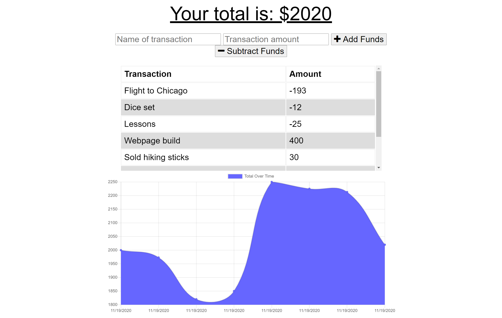
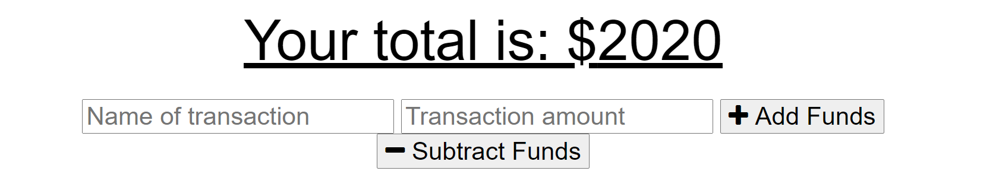

# Budget Tracker

## Table of Contents

* [Description](#description)
* [Links](#links)
* [Screenshots](#screenshots)
* [Installation Instructions](#installation-instructions)
* [Usage](#usage)
* [Technologies Used](#technologies-used)
* [Tests](#tests)
* [Credits](#credits)
* [Contributing](#contributing)
* [Questions](#questions)
* [Badges](#badges)

## Description

This is a budget-tracking app using Node.js, Express, MongoDB, and Mongoose, with the capability to continue functioning when no internet connection is available. Data entered when no internet is available is cached, then uploaded to the database upon internet reconnection. The user shouldn't notice any difference in functionality between online and offline.

To use this app, the user enters a transaction name and dollar amount into the appropriate fields in the form at the top of the page, then clicks either "+ Add Funds" or "- Subtract Funds" as appropriate. The total amount of all transactions is shown above the form, a list of previous transactions below the form, and a graph of transaction history is shown below that.

## Links

[Deployed application on Heroku](https://cryptic-cliffs-84728.herokuapp.com/)

## Screenshots

Landing page:


User input form:


## Installation Instructions

If you want to run a copy of this app on your local machine, first you will also need to download MongoDB. For help, visit the MongoDB website here:
```
https://docs.mongodb.com/manual/installation/
```

Once installed, make sure MongoDB is running by entering into the command line
```
$ mongod
```

Then, clone the repository:

HTTPS:
```
$ git clone https://github.com/LauraCole1900/pwaBudgetTracker.git
```

SSH:
```
$ git clone git@github.com:LauraCole1900/pwaBudgetTracker.git
```

Then cd/ into the cloned directory and download the dependencies by typing into the command line
```
$ npm install --save
```

Once MongoDB and the dependencies and MongoDB is running, start the application by typing into the command line
```
$ node server.js
```

Then go to the browser and enter into the address bar
```
$ localhost:3000
```

## Usage

This app is intended to be used to track a user's transactions and budget, whether or not the user is connected to the internet.

## Technologies Used

[](https://nodejs.org/en/) [](https://expressjs.com/) [](https://www.mongodb.com/) [](https://mongoosejs.com/)

## Tests

npm run test

## Credits

Base code and online functionality developed and provided by 2U/Trilogy Education Services

## Contributing

We believe code is never finished, welcome your contributions to enhance the applications functionality. Please adhere to the Code of Conduct for the Contributor Covenant, version 2.0, at https://www.contributor-covenant.org/version/2/0/code_of_conduct.html.

## Questions

If you have further questions, you can reach me at lauracole1900@comcast.net. For more of my work, see [my GitHub](https://github.com/LauraCole1900).

## Badges

[](./LICENSE) [](https://open.vscode.dev/LauraCole1900/pwaBudgetTracker)
